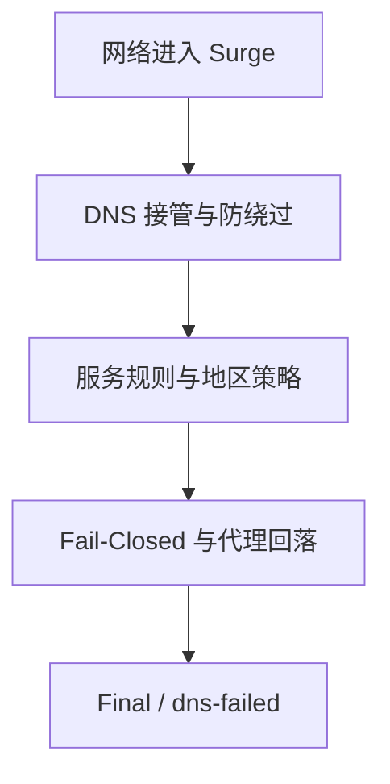

# Surge iOS Privacy + Push R12.14

> 把 DNS、推送、分流和失败关闭放在同一份可审计的配置里。

这是一套面向 Surge iOS 的配置仓库。仓库提供主配置、远程规则集、审计工具、GitHub Actions 工作流、发布清单和校验文件。它解决的是分流、DNS、推送、失败关闭和仓库维护问题，节点订阅仍由使用者自行提供。

本版本的正式运行仓库为 `shenjlngbIng/surge`。主配置中的所有仓库 Raw 与 jsDelivr 地址都指向该专用仓库，不再依赖旧的 `shenjlngbIng/-` 仓库。

公开仓库可以保存配置模板，不能保存带有 Token 的真实订阅地址。当前主配置中的 AllServer 使用不可路由的占位地址。公开配置直接导入 Surge 后，AllServer 显示 404 属于预期结果。完成私有副本并替换订阅地址以后，节点才会出现。

本文按实际部署顺序编写。第一次使用时，建议从“先完成什么”开始阅读。

| 你现在要做的事 | 从这里开始 |
| --- | --- |
| 第一次部署 | [先完成这几件事](#先完成这几件事) |
| 填入自己的订阅 | [私有订阅配置](#私有订阅配置) |
| 了解 DNS 和网络范围 | [DNS 设计](#dns-设计) 与 [网络接管范围](#网络接管范围) |
| 查找节点或规则异常 | [常见故障](#常见故障) |
| 维护仓库和生成发布包 | [本地审计](#本地审计) 与 [发布前检查清单](#发布前检查清单) |
| 查看参考来源 | [参考配置与 Sub-Store 资料](#参考配置与-sub-store-资料) |

## 这份配置的几个关键取舍

这套配置有四个需要提前说明的取舍。它们直接对应配置里的开关和规则，遇到问题时也方便按项排查。

| 设计取舍 | 配置里的具体做法 |
| --- | --- |
| 网络范围分开处理 | Wi-Fi 和蜂窝数据纳入接管，局域网设备流量保持兼容，APNs 单独处理 |
| DNS 走加密通道 | 加密 DNS 使用 DoH 与 DoT，明文 53 端口统一接管，853 和 8853 端口拒绝绕过 |
| 出现故障时及时收口 | `Fail-Closed`、代理回落和 `FINAL,Final,dns-failed` 共同处理节点与规则异常 |
| 修改之后能够追踪 | 规则通过仓库 CDN 与固定上游加载，规则有锁文件，发布内容有清单和 SHA-256 |

## 一条连接的处理流程

下面这条路径就是这份配置的主线。规则集负责判断流量去哪里，失败关闭负责在判断条件或节点不可用时停止继续放行。



## 先完成这几件事

1. 在仓库中创建 `.github/workflows/install.yml`，内容使用发布包内的同名文件。
2. 把 `Surge-R12.14-release.zip` 上传到仓库根目录。
3. 在 Actions 页面手动运行 `Install and audit Surge R12.14`。
4. 等安装提交和随后自动开始的审计都通过。
5. 确认仓库中的 Surge.conf 可以通过 Raw 打开，Rules/ 规则地址可以通过 jsDelivr 打开。
6. 复制一份 Surge.conf 作为私有副本。
7. 只修改私有副本中 AllServer 的 policy-path。
8. 将私有副本导入 Surge，先更新 AllServer，确认节点出现以后再检查规则集。

安装工作流会校验 ZIP、展开全部文件并从仓库删除 ZIP。Surge 最终读取的是配置文本，GitHub 最终保存的是解压后的仓库文件；ZIP 只在首次安装过程中临时存在。也可以先在本地解压，再把全部内容直接上传到仓库根目录。

本次发布包是完整仓库包。`Surge.conf` 只引用外部 `RULE-SET`/`DOMAIN-SET`，规则内容保存在 `Rules/*.list` 独立文件中，不会内嵌进主配置。完整包可由 `python3 tools/package_release.py` 重新生成。

## 当前版本概览

| 项目 | 当前内容 |
| --- | --- |
| 适用客户端 | Surge iOS 5.14.6 及以上 |
| 配置模式 | rule mode |
| 主配置有效顶层规则 | 85 条 |
| 规则来源 | 28 个本地维护规则集（26 个 RULE-SET + 2 个 DOMAIN-SET） |
| 规则锁文件 | 2 个 |
| 维护脚本 | 12 个 Python 文件 |
| GitHub Actions | 1 个安装与审计工作流 |
| IPv6 | 已启用 |
| Wi-Fi 与蜂窝数据 | 纳入 Surge 接管范围 |
| 蜂窝系统服务 | 不额外接管 IMS、VoLTE、MMS 等运营商专用流量 |
| 局域网设备流量 | 保持局域网兼容 |
| APNs | 纳入接管，ApplePush 代理优先并回落直连 |
| 普通 DNS | 223.5.5.5、223.6.6.6 |
| 加密 DNS | 阿里 DoH 与 DoT |
| 最终策略 | Final |
| 最终策略故障标记 | dns-failed |
| 公开订阅地址 | example.invalid 占位地址 |

当前包没有嵌入规则内容、真实订阅、Sub-Store Core、Sub-Store Simple、Vendor 运行文件或 MITM 私钥。公开包可以直接上传，真实订阅应放在私有副本中。

## 发布包的完整结构

解压后，仓库根目录应当直接看到以下内容。

```
仓库根目录/
├── Surge.conf
├── README.md
├── CHANGELOG.md
├── MIGRATION.md
├── RELEASE_MANIFEST.txt
├── SHA256SUMS.txt
├── SHA256SUMS_fixed.txt
├── LICENSE
├── NOTICE.md
├── SECURITY.md
├── CONTRIBUTING.md
├── .gitignore
├── Rules/
│   ├── 28 个规则集 list 文件
│   ├── r10.lock.json
│   └── upstreams.lock.json
├── tools/
│   └── 12 个维护脚本
├── .github/
│   └── workflows/
│       └── install.yml
└── THIRD_PARTY_LICENSES/
    ├── SukkaW-AGPL-3.0.txt
    └── blackmatrix7-GPL-2.0.txt
```

.github 是隐藏目录。手机文件选择器有时不会显示它，上传时需要确认 install.yml 在 `.github/workflows/` 中。

README、清单、校验文件和许可证都属于发布内容。只上传 Surge.conf 或只上传 Rules/ 都不完整。

## 上传到 GitHub

### 方法一：手机端自动安装

先把发布包内的 `.github/workflows/install.yml` 建到仓库相同路径，再把未解压的 `Surge-R12.14-release.zip` 上传到仓库根目录。打开 Actions，手动运行 `Install and audit Surge R12.14`。工作流会限制文件数量、单文件大小、总大小和路径类型，校验 SHA-256 后再展开文件；安装成功后会删除 ZIP 并提交完整仓库。

不要只上传 ZIP 后直接导入 Surge。ZIP 只是安装载体，必须等工作流将它展开。

### 方法二：解压后直接上传

在电脑或手机上解压 ZIP，把解压后的全部文件和文件夹上传到仓库根目录。完成后，仓库首页应当直接看到 Surge.conf。此方法不需要手动运行安装任务，提交后会自动进行审计。

下面这种目录层级会导致 Raw 地址失效。

```
仓库根目录/
└── Surge_iOS_Privacy_Push_R12.14/
    └── Surge.conf
```

正确层级如下。

```
仓库根目录/
├── Surge.conf
└── Rules/
    ├── China.list
    └── Global.list
```

仓库默认使用 main 分支。若实际分支名称不同，需要同步修改 Surge.conf 中的仓库 CDN 地址，并重新生成锁文件、发布清单和 SHA-256。

### 检查 Actions

上传并提交以后，打开仓库的 Actions 页面。install.yml 在普通提交和 Pull Request 时检查配置、规则、锁文件、清单、校验值和 Python 工具；手动触发时会安全校验并展开仓库根目录中的 `Surge-R12.14-release.zip`。

Actions 通过以后，才适合继续排查 Surge 外部资源。若审计失败，先按照日志修正仓库内容，不要直接手工修改 SHA-256。

## 三种地址要分清

这套配置会用到三种地址，它们的用途不同。

| 地址 | 用途 |
| --- | --- |
| 主配置 Raw 地址 | Surge 导入主配置 |
| 规则集 CDN 地址 | Surge 读取单个 RULE-SET 或 DOMAIN-SET |
| Sub-Store Surge 输出地址 | AllServer 读取节点策略 |

仓库主配置地址示例。

```
https://raw.githubusercontent.com/shenjlngbIng/surge/main/Surge.conf
```

仓库规则集通过 jsDelivr 读取，避免中国网络环境下 GitHub Raw 不稳定。规则集地址示例。

```
https://cdn.jsdelivr.net/gh/shenjlngbIng/surge@main/Rules/China.list
```

Sub-Store 输出地址示例。

```
https://sub.store/download/你的输出标识?target=Surge
```

主配置 Raw 地址不能填写到 AllServer 的 policy-path。规则集 CDN 地址也不能填写到 policy-path。policy-path 需要一份最终返回 Surge 节点策略的输出地址。

GitHub 仓库首页、Sub-Store 网页首页、模块地址、Clash 输出地址、V2Ray 输出地址和 Base64 原始订阅都不适合作为 policy-path。

## 私有订阅配置

### 为什么公开配置会显示 404

当前公开配置保留下面这一行。

```ini
AllServer = fallback, Fail-Closed, policy-path=https://example.invalid/REPLACE_WITH_SUB_STORE_URL, update-interval=3600, interval=600, timeout=5, evaluate-before-use=true, no-alert=0, hidden=0, include-all-proxies=true
```

example.invalid 只承担占位作用，不会返回节点。它能避免真实订阅地址进入公开仓库，也能让使用者明确知道需要建立私有副本。

### 正确的修改方式

复制 Surge.conf，保存为自己的私有配置。找到 [Proxy Group] 下的 AllServer，只替换 policy-path 后面的 URL，其他参数保持原样。

```ini
AllServer = fallback, Fail-Closed, policy-path=https://sub.store/download/你的完整输出地址?target=Surge, update-interval=3600, interval=600, timeout=5, evaluate-before-use=true, no-alert=0, hidden=0, include-all-proxies=true
```

真实订阅地址只放在私有副本中。不要把它提交到公开仓库、README、Issue、截图、日志或 Release 说明。

### Sub-Store 输出要求

在 Sub-Store 中生成目标格式为 Surge 的输出地址，并从界面直接复制完整 URL。问号后面的参数属于 URL 的一部分，复制时不能丢失。

订阅名称中出现 -copy8759 一类文字时，它通常属于名称或复制标识。不要手工拼接输出地址，直接从 Sub-Store 复制完整结果更稳妥。

### 导入顺序

1. 导入私有配置副本。
2. 等主配置载入完成。
3. 打开 Surge 的外部资源页面。
4. 单独更新 AllServer。
5. 等真实节点名称出现。
6. 选择节点并等待测速。
7. 再按需更新规则集。

AllServer 和外置规则集是两项独立流程。订阅出错时，不建议一次更新全部外部资源，否则很难判断具体故障位置。

## Core、Simple 和模块资源

当前主配置没有 [Script] 段，也没有嵌入 Sub-Store Core、Sub-Store Simple 或 Vendor 文件。仓库中的工具脚本只负责审计、转换、锁定和发布，不会在 Surge 运行时加载订阅管理程序。

若 Surge 的外部资源页面出现 Core、Simple、Gist 脚本、VIP 解锁脚本或其他旧资源，它们通常来自此前导入过的配置或模块。当前主配置不会主动生成这些项目。

需要订阅管理模块时，只保留一套来源明确的模块，并把模块地址放在模块安装位置。模块地址不能填写到 policy-path。

官方模块地址示例。

```
https://raw.githubusercontent.com/sub-store-org/Sub-Store/master/config/Surge.sgmodule
```

Core、Simple、多个版本模块和旧 Gist 资源同时存在时，排查会变得困难。已经停用的旧资源可以在 Surge 外部资源页面停用或删除。

## 网络接管范围

当前配置包含下面几项。

```ini
include-all-networks = true
include-local-networks = false
include-apns = true
include-cellular-services = false
allow-wifi-access = false
allow-hotspot-access = false
```

各项作用如下。

| 项目 | 当前行为 |
| --- | --- |
| Wi-Fi 普通互联网流量 | 纳入 Surge 接管 |
| 4G 或 5G 普通互联网流量 | 纳入 Surge 接管 |
| APNs 推送 | 纳入 Surge 接管 |
| IMS、VoLTE、Wi-Fi Calling、MMS 等蜂窝系统服务 | 不额外纳入 Surge 接管 |
| 路由器、NAS、打印机和局域网发现 | 保持局域网兼容 |
| 其他设备借用本机 Surge 代理 | 禁止 |
| 手机热点相关代理共享 | 禁止 |

include-all-networks=true 代表 Wi-Fi 和蜂窝网络都进入接管范围。include-local-networks=false 只影响局域网设备流量，不会关闭 Wi-Fi 上网。allow-wifi-access=false 只控制其他设备使用本机 Surge 代理的权限。

include-cellular-services=false 只避免额外接管 IMS、VoLTE、Wi-Fi Calling、MMS 和可视语音邮件等运营商专用流量。它不会关闭普通 4G/5G 数据，也不会关闭 APNs；前者由 include-all-networks 控制，后者由 include-apns 单独控制。

Surge 对 include-all-networks 显示“仅供临时使用，可能影响 AirDrop 和 Xcode”的警告属于官方预期提示。这里保留该选项是为了配合 include-apns 接管 APNs；若关闭它，这套 Telegram 后台推送方案也会失去 APNs 分流能力。

如果网页和 App 都能访问，但 AirDrop、打印机或 NAS 异常，先检查 include-local-networks 是否仍为 false。这个问题通常不需要先改 DNS。

## DNS 设计

当前 DNS 配置如下。

```ini
dns-server = 223.5.5.5, 223.6.6.6
encrypted-dns-server = https://dns.alidns.com/dns-query, tls://dns.alidns.com
encrypted-dns-follow-outbound-mode = false
hijack-dns = *:53
allow-dns-svcb = false
```

[Host] 中保留了阿里 DNS 的引导映射。

```ini
dns.alidns.com = 223.5.5.5, 223.6.6.6, 2400:3200::1
```

dns-server 主要用于加密 DNS 主机的启动引导和连通性检查。普通域名解析优先使用 encrypted-dns-server 中的 HTTPS 和 TLS 通道。

encrypted-dns-follow-outbound-mode=false 让加密 DNS 走固定的直连路径，减少代理服务器域名解析再次依赖代理策略的循环。

这些 Host 映射只用于 DNS 引导，和代理节点配置无关。

### DNS 防绕过

encrypted-dns-follow-outbound-mode=false 时，Surge 自身的加密 DNS 固定直连并绕过普通规则系统，因此旧的 DOH、DOH3、DOQ 协议规则和 EncryptedDNS 策略组不会参与这条内部解析链，R12.14 已将它们删除。配置仍接管常见明文 DNS，并阻断传统 DoT 和部分备用 DNS 端口。

```ini
DEST-PORT,53,REJECT
DEST-PORT,853,REJECT
DEST-PORT,8853,REJECT
```

DNS 域名规则仍限制应用自行访问常见公共解析服务。Surge 诊断页面出现单个公共 DNS 超时，不能单独证明加密 DNS 整体失效，应结合普通网站、节点测速和外部资源更新结果一起判断。

## 策略组与故障关闭

### Final

Final 是未命中专用规则时使用的最终策略组。

```ini
Final = select, Proxy, REJECT, no-alert=0, hidden=0, include-all-proxies=0
```

Final 提供 Proxy 和 REJECT 两个明确选项。规则未命中时，配置使用 FINAL,Final,dns-failed 收束流量。代理故障时可以手动选择 REJECT，避免把失败误判为直连成功。

### Proxy

Proxy 是普通代理流量使用的总入口。

```ini
Proxy = select, AllServer, HongKong, TaiWan, Japan, Singapore, America, no-alert=0, hidden=0, include-all-proxies=0
```

AllServer 放在地区组之前，便于首次导入后直接确认订阅是否返回了节点。地区组为空时，先看节点名称是否包含对应地区关键词。

### AllServer

AllServer 使用 fallback 模式，并把 Fail-Closed 放在真实订阅之前。

```ini
AllServer = fallback, Fail-Closed, policy-path=..., update-interval=3600, interval=600, timeout=5, evaluate-before-use=true, no-alert=0, hidden=0, include-all-proxies=true
```

| 参数 | 作用 |
| --- | --- |
| fallback | 按顺序尝试可用节点 |
| Fail-Closed | 没有真实节点时阻止流量 |
| update-interval=3600 | 每小时刷新订阅策略 |
| interval=600 | 测试结果有效 600 秒，避免每分钟遍历全部节点 |
| timeout=5 | 只把测试延迟低于 5 秒的成员视为可用；实际探测上限由 test-timeout 控制 |
| evaluate-before-use=true | 使用前先评估节点 |
| include-all-proxies=true | 接收输出中的全部代理节点 |

### Fail-Closed

Fail-Closed 定义如下。

```ini
Fail-Closed = http, 127.0.0.1, 1, no-error-alert=true
```

它指向一个无效的本地地址，用来表达“当前没有可用代理”。`no-error-alert=true` 会抑制这个刻意制造的连接失败告警；策略仍可能显示红色，这是预期状态。需要检查的是 AllServer 中是否已经出现真实节点。

### ApplePush

ApplePush 使用代理优先、直连回落。

```ini
ApplePush = fallback, Proxy, DIRECT, interval=60, timeout=5, no-alert=0, hidden=0
```

APNs 规则位于 Rules/APNs.list。include-all-networks=true 与 include-apns=true 共同决定系统推送是否进入 Surge 接管范围。

### Telegram 与 APNs 推送

Telegram 的应用数据和系统通知是两条独立链路。

| 流量 | 规则路径 | 故障时行为 |
| --- | --- | --- |
| Telegram 消息、媒体和前台连接 | `Rules/Telegram.list` → `Telegram` → 代理 | 不增加 DIRECT 路径 |
| iOS 后台通知唤醒 | `Rules/APNs.list` → `ApplePush` → `Proxy, DIRECT` | 代理不可用时由 APNs 直连回落 |

这对应 APNs 专用规则加代理优先回落的处理方法。关闭 include-cellular-services 不会影响上述两条链路。若代理节点故障，系统仍可通过 APNs 直连收到通知唤醒；Telegram 的消息正文和媒体继续遵守 Telegram 代理策略。

## 地区组

地区组通过节点名称筛选香港、台湾、日本、新加坡和美国节点，并使用 url-test 选择延迟合适的节点。

筛选只按节点名称中的地区关键词匹配，不再排除名称中带有专用、解锁等字样的节点。节点名称不含地区关键词时，它不会出现在对应地区组中。此时 AllServer 仍可能正常，地区组为空只说明名称筛选没有匹配到。

地区组统一包含 Fail-Closed 和 AllServer 作为回落来源。地区组测速失败时，先确认订阅节点名称、节点状态和 policy-regex-filter。

## 远程规则集

主配置只引用仓库中的 28 个维护规则集，并通过 jsDelivr 读取。运行链不再加载上游 Direct、China、Global 及其巨型域名集合；两个精确 `DOMAIN-SET` 负责明确国内外域名。专用服务规则优先命中，明确国内域名走 DIRECT，明确国外域名走 Proxy；未列出的流量继续由 `GEOIP,CN` 和 `FINAL` 兜底。规则内容始终保存在独立文件中，主配置不内嵌规则快照。

### 规则集清单

| 文件 | 策略组 | 内容 |
| --- | --- | --- |
| APNs.list | ApplePush | Apple 推送 |
| AppleCN.list | Apple | Apple 国内服务 |
| WeChat.list | DIRECT | 微信服务 |
| Direct.list | DIRECT | 精选国内服务 |
| China.list | DIRECT | 306 条明确归属的国内域名 |
| Global.list | Proxy | 116 条明确归属的国外域名 |
| Ads.list | AdBlock | 广告和追踪 |
| ChatGPT.list | ChatGPT | ChatGPT |
| Claude.list | Claude | Claude |
| Gemini.list | Gemini | Gemini |
| YouTube.list | YouTube | YouTube |
| Netflix.list | NETFLIX | Netflix |
| Disney.list | Disney+ | Disney+ |
| HBO.list | HBO | HBO 与 Max |
| PrimeVideo.list | PrimeVideo | Prime Video |
| Emby.list | Emby | Emby 与 Jellyfin 服务 |
| TikTok.list | TikTok | TikTok |
| Bahamut.list | Bahamut | 巴哈姆特 |
| BiliBiliIntl.list | Streaming | 哔哩哔哩国际服务 |
| Spotify.list | Spotify | Spotify |
| ProxyMedia.list | Streaming | 其他流媒体 |
| Telegram.list | Telegram | Telegram |
| Github.list | GitHub | GitHub |
| Twitter.list | X | X 与 Twitter |
| Google.list | Google | Google 服务 |
| OneDrive.list | Microsoft | OneDrive |
| Microsoft.list | Microsoft | Microsoft 服务 |
| Game.list | Games | 游戏服务 |

两个精确域名集不收录 `.cn`、`.com` 等整段公共后缀，不使用 `DOMAIN-KEYWORD`，也不把 AWS、Azure、Cloudflare、Akamai 等共享基础设施强行归到某一侧。国内集和国外集之间必须保持零后缀冲突。

### 规则匹配顺序

Surge 按从上到下的顺序匹配规则，先命中的规则结束本次匹配。当前顺序如下。

```
局域网发现、CGNAT 与组播
→ Apple 系统查询直连保护
→ DNS 域名规则和端口阻断
→ APNs
→ Apple、微信、国内精选服务和广告
→ ChatGPT、Claude、Gemini
→ 流媒体
→ Telegram、GitHub、X、Google、Microsoft 和游戏
→ China
→ Global
→ GEOIP,CN,DIRECT
→ STUN
→ FINAL
```

YouTube、ChatGPT、Google、Microsoft 等专用服务必须先于精确总分流命中。国内精确集统一使用 DIRECT，国外精确集统一使用 Proxy；审计脚本会拒绝重复后缀、共享云/CDN、格式错误及国内外交叉冲突。

当前配置不使用宽泛的 `DOMAIN-SUFFIX,cn,DIRECT`，也不尝试通过巨型域名表覆盖整个互联网。明确域名由精确集处理，未知国内地址由 GEOIP 处理，其他未知流量由 FINAL 代理。修改规则顺序会改变服务专用分流边界。

### 规则集暂时无法访问

规则 CDN 暂时不可达时，Surge 可能继续使用本地缓存。缓存取决于客户端状态和更新时间，不能当作永久可用条件。

规则源暂时失败时，主配置后面的 GEOIP、协议规则和 FINAL 仍然参与处理。配置保留失败关闭边界，远程规则短时不可用不会自动把全部流量放行。

### Aegis 的采用边界

当前配置参考了 [Aegis](https://github.com/Thoseyearsbrian/Aegis) 的模块化组织思路，将 DNS 接管、显式拒绝、UDP 处理和审计锁定分开管理。实际采用范围和未采用内容已经在前面的来源说明中列出。

Scam、Quarantine、Malware IOC 等威胁情报列表更新快，误判会直接影响正常访问。当前包没有把这些外部威胁情报源直接加入规则链。后续若启用，应单独审查来源、格式、误判处理和回滚方式。

## 仓库维护文件

### Rules/r10.lock.json

记录主配置摘要、活动规则数量、远程规则源数量和关键不变量。主配置或规则源发生变化时，需要重新生成。

### Rules/upstreams.lock.json

记录规则集上游来源、精确域名集的数量与摘要，用于审计规则来源和人工维护变化。

### RELEASE_MANIFEST.txt

记录进入发布包的正式文件。当前清单记录 54 个文件。

SHA256SUMS.txt、SHA256SUMS_fixed.txt 和 RELEASE_MANIFEST.txt 本身属于发布附属文件，因此最终 ZIP 的非目录文件总数为 57 个。

### SHA256SUMS.txt

记录当前发布文件的 SHA-256。它用于检查上传、打包或传输过程中是否发生文件变化。

### SHA256SUMS_fixed.txt

用于校验 SHA256SUMS.txt 本身是否与固定结果一致。两个 SHA 文件都应保留。

## 本地审计

手机端使用 Surge 不需要安装 Python。Python 工具只用于仓库维护和发布前检查。

在仓库根目录运行下面的命令。

```bash
python3 tools/convert_to_remote_rules.py
python3 tools/embed_runtime_rules.py
python3 tools/audit_config.py
python3 tools/audit_rules.py
python3 tools/audit_precise_domains.py
python3 tools/test_audit_config.py
python3 tools/test_stage_surge_zip.py
python3 -m compileall -q tools
python3 tools/generate_release_manifest.py
python3 tools/generate_checksums.py
python3 tools/package_release.py --output ../Surge-R12.14-release.zip
sha256sum -c SHA256SUMS.txt
cmp --silent SHA256SUMS.txt SHA256SUMS_fixed.txt
```

当前版本的预期结果如下。

```text
PASS: remote-only profile; external_rules=28 embedded_rule_contents=0
PASS R12.14 rules=85
PASS R12.14 remote_sources=28 rules=85
PASS precise domains DIRECT=306:41bcedfa2bd3 Proxy=116:99adfaea6b33 conflicts=0
PASS mutations=31
PASS: ZIP allowlist regression cases=14
PACKAGED: files=57
SHA256SUMS.txt 全部 OK
SHA256SUMS.txt 与 SHA256SUMS_fixed.txt 一致
```

修改下面任意内容以后，都应重新运行生成和审计命令。

- Surge.conf
- Rules/*.list
- Rules/r10.lock.json
- Rules/upstreams.lock.json
- README.md
- CHANGELOG.md
- tools/*.py
- .github/workflows/*.yml
- LICENSE、NOTICE.md、SECURITY.md 和其他发布文件

不要手工填写 SHA-256。先修改文件，再运行生成脚本。

## GitHub Actions

### install.yml

install.yml 把首次安装和后续审计合并在同一个文件中。手动运行时，它会安全展开并校验仓库根目录中的 `Surge-R12.14-release.zip`，删除 ZIP，再提交完整文件。安装包内包含完全相同的 install.yml，因此安装提交不会尝试修改工作流文件，也就不会触发 GitHub App 对工作流文件的权限限制。

首次只提交 install.yml 和 ZIP 时，普通提交触发的审计会显示成功并提示等待手动安装，不会因为完整配置尚未展开而误报失败。

提交到 main 或创建 Pull Request 时，install.yml 会执行以下审计。

1. Python 工具是否可以编译。
2. Surge.conf 的章节和关键选项是否存在。
3. 策略组和规则顺序是否符合约束。
4. Rules/ 中的规则格式和锁文件是否一致。
5. 配置变异测试是否通过。
6. ZIP 白名单测试是否通过。
7. 发布清单是否和当前文件一致。
8. SHA-256 是否一致。

工作流不会生成个人订阅，也不会修复已经失效的节点。节点服务、Token 和 Sub-Store 输出地址仍需要使用者自行维护。

## Raw 地址检查

上传以后先检查主配置。

```
https://raw.githubusercontent.com/shenjlngbIng/surge/main/Surge.conf
```

正常结果是直接显示以 [General] 开头的纯文本。

再检查任意一个规则集。

```
https://cdn.jsdelivr.net/gh/shenjlngbIng/surge@main/Rules/China.list
```

正常结果应当显示以点开头的 DOMAIN-SET 域名条目。

出现下面情况时，优先检查仓库路径和分支。

- 打开的是 GitHub 网页而非纯文本。
- 返回 404。
- 下载内容前面多了一层目录名。
- Surge.conf 可以打开，但 Rules/China.list 的 CDN 地址无法打开。
- 文件被上传到了其他分支。
- 仓库是私有仓库，但 Surge 无法访问对应 CDN 地址。

## 常见故障

### AllServer 返回 404

先确认使用的是私有配置副本，并检查 policy-path 是否仍然是 example.invalid。

替换以后，在浏览器中打开完整的 Sub-Store Surge 输出 URL。确认 URL 没有被截断，问号后的参数仍然存在，订阅输出仍然有效。

404 表示请求地址不存在。修改 DNS、精确域名集或规则顺序无法恢复一个失效的订阅地址。

### AllServer 返回 500

500 通常来自订阅转换服务端。

- 浏览器也返回 500 时，检查订阅源、Token、输出参数和 Sub-Store 服务状态。
- 浏览器返回 Surge 文本而 Surge 仍报错时，检查 policy-path 的复制结果和配置语法。
- 返回网页、JSON 错误或 Clash 内容时，重新生成目标为 Surge 的输出。

### NSURLErrorDomain -1001

请求超时需要看具体资源。

- 只有 Sub-Store 超时，检查订阅输出地址。
- 只有一个规则 CDN 超时，检查对应文件是否已上传到正确分支。
- 所有外部资源都超时，检查网络、DNS 和 GitHub 可达性。
- 节点测速超时，检查节点服务商、节点参数和当前网络。

### Fail-Closed 报 POSIX 61

Fail-Closed 是指向本机无服务端口的失败关闭哨兵，连接被拒绝是它的预期结果。R12.14 为它加入 no-error-alert，并把 AllServer 的探测结果有效期从 60 秒延长到 600 秒，避免持续弹出刻意制造的错误及频繁遍历全部节点。若 AllServer 里只有 Fail-Closed，说明私有 policy-path 尚未返回任何真实节点。

### configuration.ls.apple.com 请求过密

R12.14 在所有远程规则之前加入 `DOMAIN-SUFFIX,ls.apple.com,DIRECT`，避免 Apple 配置查询进入代理选择或失败回落环路。若升级后仍出现每秒数百次请求，先在 Surge 请求日志中确认发起进程；这也可能是某个应用或 iOS 服务自身的重试循环，配置只能消除错误路由，不能修复应用进程本身。

### 节点出现但全部红色

这说明订阅输出已经返回节点列表。可以按下面顺序检查。

1. 订阅是否到期。
2. 流量或设备数是否达到限制。
3. 节点服务器是否仍在运行。
4. 密码、端口、UUID、加密方式或混淆参数是否发生变化。
5. 当前 Wi-Fi 或蜂窝网络能否连接节点服务器。
6. proxy-test-url 在当前网络是否可达。

配置可以改善筛选、测速和回落流程，无法修复已经失效的节点服务。

### 外部资源页面出现旧资源

如果页面出现 Core、Simple、Gist 脚本、Vendor 或旧的解锁脚本，先检查 Surge 中已经安装的模块和外部资源。它们来自客户端已有配置时，重新上传仓库不会自动移除。

停用不再使用的旧资源，只保留当前配置需要的资源。主配置本身没有嵌入这些文件。

### DNS 诊断出现超时

单个公共 DNS 超时不等于所有 DNS 都失效。先检查普通网站、节点测速、主配置 Raw 地址和规则集 CDN 地址。

当前配置使用加密 DNS 作为普通解析通道，同时使用明文 DNS 完成加密 DNS 主机的启动引导。若所有外部资源都无法更新，再检查网络、DNS 引导地址和运营商连通性。

### 局域网设备无法访问

确认 include-local-networks=false，skip-proxy 中的私有网段仍然存在，局域网和组播规则没有被移动到后面。

allow-wifi-access=false 只禁止其他设备借用本机 Surge 代理，不影响手机自身使用 Wi-Fi。

## 安全边界

- 真实订阅 URL 只放私有副本。
- 订阅 Token 一旦出现在公开仓库、Issue、截图或日志中，应立即更换。
- 不要把 MITM 私钥、证书口令或节点密码写入公开文件。
- 遇到证书错误时，不要关闭 TLS 校验，也不要安装来源不明的证书。
- 修改公开规则前，先确认规则来源、格式和误判风险。
- 保留 RELEASE_MANIFEST.txt 和 SHA256SUMS.txt，方便确认仓库文件没有被意外替换。

## 发布前检查清单

上传仓库前，逐项确认。

- [ ] Surge.conf 位于仓库根目录。
- [ ] README.md 是当前版本。
- [ ] MIGRATION.md 已包含本版本迁移说明。
- [ ] Rules/ 中有 28 个维护 list 文件。
- [ ] Rules/r10.lock.json 和 Rules/upstreams.lock.json 都在。
- [ ] tools/ 中有 12 个 Python 脚本。
- [ ] .github/workflows/ 中有 install.yml。
- [ ] THIRD_PARTY_LICENSES/ 中的许可证文件完整。
- [ ] 真实订阅地址没有进入公开文件。
- [ ] AllServer 仍使用公开占位地址。
- [ ] 私有副本只替换了 AllServer 的 policy-path。
- [ ] 主配置 Raw 地址可以打开。
- [ ] 至少一个仓库规则 CDN 地址可以打开。
- [ ] GitHub Actions 审计通过。
- [ ] SHA-256 校验通过。
- [ ] 仓库中没有继续使用的旧 Core、Simple、Vendor 或 Gist 资源。

## 使用时只记住三点

第一，公开模板直接导入时 AllServer 404 是因为订阅地址仍是占位符。

第二，真实订阅只放私有副本，policy-path 只替换成完整的 Surge 输出地址。

第三，出现问题时把订阅、规则集、DNS 和节点测速分开检查。这样能更快定位故障，也不会为了修一个订阅地址去改动已经稳定的 DNS 和分流规则。

## 参考配置与 Sub-Store 资料

本节集中记录本包参考过的公开配置、订阅管理资料和实际规则来源。以后维护时，读者可以直接从这里查到每个来源的地址和使用范围。

### 参考过的 Surge 配置

| 项目 | 配置地址 | 在本包中的关系 |
| --- | --- | --- |
| Rabbit-Spec Surge Developer | [Surge-Developer.conf](https://raw.githubusercontent.com/Rabbit-Spec/Surge/Master/Conf/Spec/Surge-Developer.conf) | 参考基础章节、网络选项和策略组的写法 |
| Rabbit-Spec Surge EN | [Surge-EN.conf](https://raw.githubusercontent.com/Rabbit-Spec/Surge/Master/Conf/Spec/Surge-EN.conf) | 参考区域策略组、远程 `RULE-SET` 和兼容性说明 |
| As-Lucky Lucky | [Lucky-Surge.conf](https://raw.githubusercontent.com/As-Lucky/Lucky/main/Lucky-Surge.conf) | 参考完整章节结构、服务分组和订阅接入方式 |
| Coldvvater | [Surge 配置 Gist](https://gist.githubusercontent.com/Coldvvater/8093bc6be4340b5324b4a343493becfe/raw/Surge,conf) | 参考 DNS、分流分类和规则集组合方式 |
| Thoseyearsbrian Aegis | [Aegis 项目](https://github.com/Thoseyearsbrian/Aegis) 与 [Aegis_TC.conf](https://raw.githubusercontent.com/Thoseyearsbrian/Aegis/main/config/Aegis_TC.conf) | 参考加密 DNS、DNS 接管、协议拒绝、显式拒绝和安全规则模块的组织方式 |

Surge 字段语义和 DNS 行为以 [Surge 官方加密 DNS 手册](https://manual.nssurge.com/dns/encrypted-dns.html)、[Fallback 手册](https://manual.nssurge.com/policy-groups/fallback.html) 与 [General 选项](https://manual.nssurge.com/profile/general.html) 为准。

### Telegram 推送方案资料

- [NodeSeek 原处理方法的网页存档](https://web.archive.org/web/20260715022631/https://www.nodeseek.com/post-709310-1)
- [Apple 官方 APNs 网络要求](https://support.apple.com/zh-cn/102266)

本包采用该方法中的 APNs 专用规则与 `Proxy → DIRECT` 回落思路，没有把全部 Apple 流量强制代理。`Rules/APNs.list` 同时覆盖 Apple 公布的 APNs IPv4、IPv6 网段和推送主机名。

### Sub-Store 相关资料

| 资料 | 地址 | 在本包中的关系 |
| --- | --- | --- |
| Sub-Store 项目 | [sub-store-org/Sub-Store](https://github.com/sub-store-org/Sub-Store) | 用于了解订阅转换和 Surge 输出的工作方式 |
| Sub-Store Surge 模块 | [Surge.sgmodule](https://raw.githubusercontent.com/sub-store-org/Sub-Store/master/config/Surge.sgmodule) | 需要在 Surge 中管理订阅时的可选模块地址 |
| Sub-Store 服务 | [sub.store](https://sub.store/) | 用于生成私有的 Surge 输出地址 |

当前公开配置只保留 `AllServer` 的占位地址。真实订阅、输出标识和 Token 需要放在私有副本中。主配置没有嵌入 Sub-Store Core、Sub-Store Simple、Vendor 文件或 Surge 模块，`Surge.sgmodule` 只作为需要时的可选安装来源。

### 实际规则来源

`Rules/*.list` 中的 19 个服务快照实际锁定上游为 [blackmatrix7/ios_rule_script](https://github.com/blackmatrix7/ios_rule_script)，提交为 `c00517ce10760a93728b241923a451dfa617be80`。两个精确域名集和其余本地规则由本仓库审核维护；运行时不再直接加载上游 Direct、China 或 Global 总规则。许可证为 GPL-2.0。具体上游路径、快照摘要、精确集摘要和排除项记录在 `Rules/upstreams.lock.json`，许可证副本位于 `THIRD_PARTY_LICENSES/`。

### 本仓库自行维护的部分

- `Surge.conf` 的策略组、DNS 引导、APNs 路由和失败关闭边界
- 28 个仓库自有 CDN 规则地址及其策略映射
- 国内/国外精确域名集、零冲突边界及其规则顺序
- 规则锁、配置审计、ZIP 白名单测试、发布清单和 SHA-256 校验
- 部署说明、故障排查、安全边界和 GitHub Actions 工作流

上面列出的公开配置属于设计参考，实际运行以本仓库当前的 `Surge.conf`、`Rules/`、锁文件、`NOTICE.md` 和许可证副本为准。本包没有带入参考项目的节点、订阅、Token、脚本、MITM 证书或未经单独审核的威胁情报规则。
